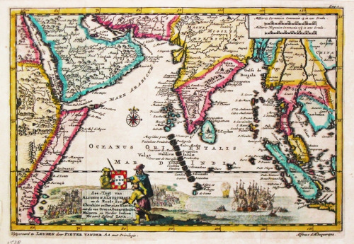

媽媽說以前常聽到長輩形容天涯海角的怪地方叫「呂宋加蛤巴」，感覺很有趣，一定要來了解一下。呂宋是菲律賓的舊稱大家都知道，加蛤巴我本來以為是歐洲，結果網路查到的是印尼雅加達舊稱。而我們現在常講的「俗 pia pia 」，也是用呂宋的「宋」來酸別人的品味，古今中外的人總是會瞧不起遠方來的不一樣之風俗。

參考: [台灣史望春風 (李筱峰、戴寶村)](http://web.ffjh.tyc.edu.tw/cojinhui/434.htm)
