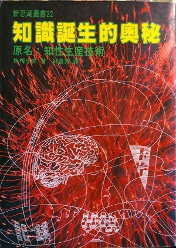

# 知識誕生的奧秘 - 梅棹忠夫 - 志文出版社 (1969)

原書名：知性生產技術

{ align=center }

忘記在那裡買了這本2手書，也忘了是什麼機緣下買的，作者 [梅棹忠夫](http://ja.wikipedia.org/wiki/梅棹忠夫>) 是日本重要的生態學家，民族學家，但我認識他卻是因為登山相關書籍。翻譯很棒，譯者叫林景淵，會適時加譯注，讓不熟日本文化的台灣人可以更了解作者想表達的意思。

日本對「知識整理」這方面實在著墨很深，如何整理，用什麼方式，工具，巨細靡遺的都討論的很透徹。這本書年代比較久遠，所以當時電腦還沒有普及，所以像為了整齊的「美感」，把日文用羅馬文字打字幾打出來，或是後來發明了假名文字打字機，現在讀起來都很有趣。

## 札記簿，卡片

從達文西的札記簿得到啟發，隨時都帶著筆記本，紀錄所有的事情。但是紀錄完後如果時候不檢索，全部往櫃子裡塞也是沒有用的，所以開始使用「卡片系統」來紀錄。

發明「京大式」（取名京都大學），12.8x18.2cm，105磅畫刊紙，可以任意抽換。

## 不分類

- 分類是為了儲藏，卡片的知識如果不加以活用的話就沒什麼意義。
- 原有資料往往可以變更組合方式而帶來新發現。這不儘是「儲蓄知識過程」，而是一種「知性創造過程」。
- 分類並非那麼重要，一而再，再而三的去翻閱他們才是最重要的。

## 打字機

筆，墨，鉛筆，鋼筆到打字機：效率，美。

## 日本文字改革

- 明治初期「羅馬字國字論」（羅馬字運動）
- 「新字論」主張用新的音節文字來標示日文，制訂了約100個字。
- 「假名文字論」主張用片假名橫寫。開始於一次大戰後大阪工商界。

對作者來說，用打字機來表達日本才是最終目標，使用羅馬字或假名都不是真正目的。
