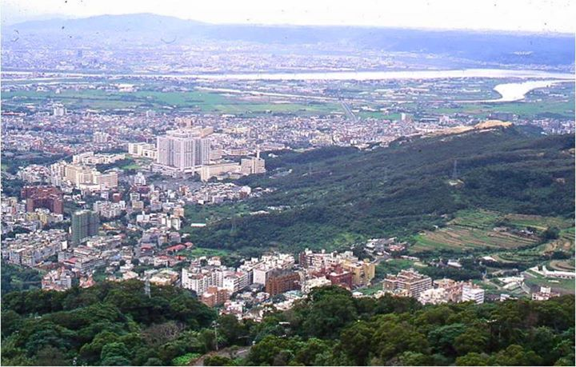
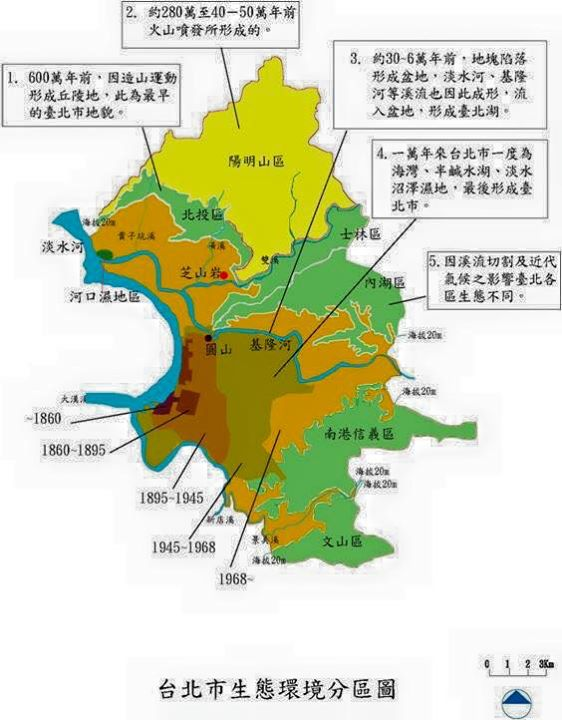

# [轉載] 「台北其實很生態」系列 - 郭城孟臉書

## 文章

### 台北其實很生態（1）

從淡水河口只能看到一種紅樹林植物，水筆仔，背後顯示，熱帶生態環境由赤道隨著黑潮進入台灣之後，熱帶訊息由南往北也逐漸降低，高雄有6種紅樹林植物的記錄，台南4種，新竹2種，至台北只剩1種，因為台北冬天深受東北季風影響氣溫較低之故。
這應該可以解釋為何有些熱帶植物在台北無法存活，有些可以活，但不會開花也不會結果，有些會開花但不會結果，等等屬於熱帶邊緣奇奇怪怪的現象在台北時有所聞。
台北盆地地形及高度都市化加深其溫室效應，現在台北夏天的溫度往往比高雄高1度，逐漸有利於熱帶植物的發展。
台北可以看見熱帶的生態現象，但不是完整的熱帶。

### 台北其實很生態（2）

春天去陽明山賞花早就是台北人的 life style，前山公園海拔400公尺，後山公園海拔500公尺，賞什麼花呢？主要是櫻花和杜鵑花。
也有很多人喜歡去南部的阿里山賞花，海拔高度2400公尺，不過賞的也是櫻花和杜鵑花，阿里山和陽明山海拔高度差距頗大，然而其景觀卻十分近似。
這主要是因為台北冬天強烈受東北季風影響，東北季風為台北帶來低溫和降水，有利於涼溫及暖溫帶植物生存於亞熱帶的台北，表面上看起來南部中、高海拔的植物下降至北部低海拔的台北，生態學上稱為北降現象。
台北近郊經常可以發現自生的溫帶植物。

### 台北其實很生態（3）

台北在全世界的生態定位是亞熱帶雨林，北緯20-30度的亞熱帶地區絕大部分的土地不是沙漠就是半沙漠，同緯度的中國南部則屬季節性乾旱的亞熱帶生態環境，金門也屬此類型的環境，乾季太長了。
亞熱帶雨林最具代表性的植物就是筆筒樹，喜歡潮濕也喜歡陽光，而這種環境在300年前是瘴癘之氣的地方，所以當時先民大都以台南（季節性乾旱的熱帶生態環境）為居住首選。
台北近郊多筆筒樹，而筆筒樹在全世界的分佈中心就在台灣北部。

### 台北其實很生態（4）

全世界的幾個大城市，如鄰近的東京、上海、北京，遠一點的美國LA、紐約，歐洲的柏林、巴黎、倫敦等，馬路的端點是空的，台北則是馬路的端點經常可以看見綠色的山。
從北投、士林、內湖、南港、信義，一直到文山地區，市區為綠色的丘陵山坡圍繞，台北人真有福氣，被自然擁抱。
城市中仍然可以看到野生螢火蟲的，全世界應該只有台北市有此能耐，因為城市就在野地中，如果我們可以從這個角度來看的話。
不過也可以這樣看，例如陽明山國家公園與全世界所有國家公園的最大不同點就是，它其實是一座都市裏的國家公園，野地也在都市中。

### 台北其實很生態（5）

台灣又老又年輕，台北也是，老的是生物相，年輕的是其地貭史，年輕土地的表徵就是高度擠壓的土地，除了城市離山很近以外，山坡就像人的手背，手指是山脊，指縫是山溝，熱帶生態沿著山溝由下往上發展，混雜在亞熱帶雨林生態之中，溫帶生態則是沿著山脊由上往下逐漸溶入亞熱帶中性生態環境，這就是為何在台北郊山散步常常可見多變的景觀的主因，國外地質史通常較台灣古老，山坡比較不會有高低起伏的現象，景觀當然也比較單調。
現任美國紐約植物園蕨類部門主管Dr.Moran十幾年前來台曾在台北郊山賞蕨，短短十來分鐘的山徑就看到將近30種蕨，這在全世界城市近郊應是絕無僅有的，他說Taipei is a fern garden。

### 台北其實很生態（6）

台北的郊山很多都是2-3000萬年前海下的沙子堆疊擠壓抬昇而形成的，概為單面山，一邊為緩坡，另一邊則較陡峭。台北的火山是後來從沈積岩的縫隙噴出或流出而形成的，山形呈錐形或鐘形，與沈積岩的山形大異其趣。
單面山的緩坡由高空觀之狀似綠手指，由郊山往市區延伸，郊山的老生物得以循此進入市區。有時則會形成跳島，被都會區包圍的小山丘，是都會區的生態避難所。
未來台北的生態有賴如何串連綠手指、跳島，以及其他的公園綠地。

### 台北其實很生態（7）

今之台北盆地其實是從30萬至6萬年前因斷層導至陷落而形成的，台北的河流系統也隨之大至底定。

一萬年前冰河期結束，高緯度地區的冰山冰河開始溶化，全世界的海平面上升，台灣海峽充滿海水，且由淡水灌入台北盆地，所以台北曾經是一處海灣，海岸林植物的種源也跟隨漂入台北，一直到今天，台北市區以及近郊還常會巧遇海邊植物。

由於盆地較低漥，臨近丘陵地不斷注入淡水，6000-5000年前台北盆地是半鹹水湖，芝山岩及圓山貝塚文化才得以應運而生，後來半鹹水湖逐漸淡化淤積，2000年前台北盆地盡是淡水沼澤濕地。

今天台北仍可見鹽分較多的河口紅樹林生態，鹽分較少的河岸生態，至於過去滿佈台北盆地的淡水濕地，今已消失殆盡。

### 台北其實很生態（8）

在台北市區或近郊還蠻常見土地自行長樹，不用特別照顧就會自己長大。
熱帶雨林地區大面積焚墾之後，土地不會自己長樹，因為熱帶雨林的養分不貯存在土壤中，而是貯存在生物的身體裏面，生物死亡後在高溫多濕的環境下快速分解，養分直接由植物的根快速吸收，所以熱帶雨林的種子落地後習慣迅速萌發而不貯存在土壤中，而是以小苗的姿態在林下等待機會，可以想像雨林遭焚墾之後為何土地不會自行長樹，因為雨林土地並不貯存種子。
溫帶地區呢？工業革命發展自歐洲，300年來不斷利用機械的力量開發大自然，高頻度的土地開墾，原來貯存在土壤中的種子受到陽光和雨水的刺激，每年都不斷地釋出，小苗來不及長大就被再次伐除，今歐、美都會地區想要看到土地自行長樹，其實機會不大。美國這一陣子也在積極復育西部大草原的野花野草，因為經過200年的開墾，美國西部大草原今天幾全淪為玉米田或是小麥田。
亞熱帶地區又如何？該區絕大部分的土地不是沙漠就是半沙漠，只有喜馬拉雅山東部至台灣是森林，中國大陸南部及台灣南部屬季節性乾旱的熱帶或亞熱帶森林，是先民較喜歡也是較早開墾的環境，尤其是中國大陸南部，所以其都會區也較不易看見土地自行長樹的現象。
所以結論是大台北地區的土地，是全世界最有生命力的土地。

## 來源:

<blockquote cite="https://www.facebook.com/kuocmntu/posts/1597807163809215">
&#x53f0;&#x5317;&#x5176;&#x5be6;&#x5f88;&#x751f;&#x614b;&#x3002;&#xff08;1&#xff09;&#x5f9e;&#x6de1;&#x6c34;&#x6cb3;&#x53e3;&#x53ea;&#x80fd;&#x770b;&#x5230;&#x4e00;&#x7a2e;&#x7d05;&#x6a39;&#x6797;&#x690d;&#x7269;&#xff0c;&#x6c34;&#x7b46;&#x4ed4;&#xff0c;&#x80cc;&#x5f8c;&#x986f;&#x793a;&#xff0c;&#x71b1;&#x5e36;&#x751f;&#x614b;&#x74b0;&#x5883;&#x7531;&#x8d64;&#x9053;&#x96a8;&#x8457;&#x9ed1;&#x6f6e;&#x9032;&#x5165;&#x53f0;&#x7063;&#x4e4b;&#x5f8c;&#xff0c;&#x71b1;&#x5e36;&#x8a0a;&#x606f;&#x7531;&#x5357;&#x5f80;&#x5317;&#x4e5f;&#x9010;&#x6f38;&#x964d;&#x4f4e;&#xff0c;&#x9ad8;&#x96c4;&#x6709;6&#x7a2e;&#x7d05;&#x6a39;&#x6797;&#x690d;&#x7269;&#x7684;&#x8a18;&#x9304;&#xff0c;&#x53f0;&#x5357;4&#x7a2e;&#xff0c;&#x65b0;&#x7af9;2&#x7a2e;&#xff0c;&#x81f3;&#x53f0;&#x5317;&#x53ea;&#x5269;1&#x7a2e;&#xff0c;&#x56e0;&#x70ba;&#x53f0;&#x5317;&#x51ac;&#x5929;&#x6df1;&#x53d7;&#x6771;&#x5317;&#x5b63;&#x98a8;&#x5f71;&#x97ff;&#x6c23;&#x6eab;...
Posted by <a href="https://www.facebook.com/kuocmntu">郭城孟</a> on <a href="https://www.facebook.com/kuocmntu/posts/1597807163809215">Mittwoch, 29. April 2015</a></blockquote>

<blockquote cite="https://www.facebook.com/kuocmntu/posts/1597841137139151">
&#x53f0;&#x5317;&#x5176;&#x5be6;&#x5f88;&#x751f;&#x614b;&#xff08;2&#xff09;&#x6625;&#x5929;&#x53bb;&#x967d;&#x660e;&#x5c71;&#x8cde;&#x82b1;&#x65e9;&#x5c31;&#x662f;&#x53f0;&#x5317;&#x4eba;&#x7684; life style&#xff0c;&#x524d;&#x5c71;&#x516c;&#x5712;&#x6d77;&#x62d4;400&#x516c;&#x5c3a;&#xff0c;&#x5f8c;&#x5c71;&#x516c;&#x5712;&#x6d77;&#x62d4;500&#x516c;&#x5c3a;&#xff0c;&#x8cde;&#x4ec0;&#x9ebc;&#x82b1;&#x5462;&#xff1f;&#x4e3b;&#x8981;&#x662f;&#x6afb;&#x82b1;&#x548c;&#x675c;&#x9d51;&#x82b1;&#x3002;&#x4e5f;&#x6709;&#x5f88;&#x591a;&#x4eba;&#x559c;&#x6b61;&#x53bb;&#x5357;&#x90e8;&#x7684;&#x963f;&#x91cc;&#x5c71;&#x8cde;&#x82b1;&#xff0c;&#x6d77;&#x62d4;&#x9ad8;&#x5ea6;2400&#x516c;&#x5c3a;&#xff0c;&#x4e0d;&#x904e;&#x8cde;&#x7684;&#x4e5f;&#x662f;&#x6afb;&#x82b1;&#x548c;&#x675c;&#x9d51;&#x82b1;&#xff0c;...
Posted by <a href="https://www.facebook.com/kuocmntu">郭城孟</a> on <a href="https://www.facebook.com/kuocmntu/posts/1597841137139151">Mittwoch, 29. April 2015</a></blockquote>

<blockquote cite="https://www.facebook.com/kuocmntu/posts/1597871343802797">
&#x53f0;&#x5317;&#x5176;&#x5be6;&#x5f88;&#x751f;&#x614b;&#xff08;3&#xff09;&#x53f0;&#x5317;&#x5728;&#x5168;&#x4e16;&#x754c;&#x7684;&#x751f;&#x614b;&#x5b9a;&#x4f4d;&#x662f;&#x4e9e;&#x71b1;&#x5e36;&#x96e8;&#x6797;&#xff0c;&#x5317;&#x7def;20-30&#x5ea6;&#x7684;&#x4e9e;&#x71b1;&#x5e36;&#x5730;&#x5340;&#x7d55;&#x5927;&#x90e8;&#x5206;&#x7684;&#x571f;&#x5730;&#x4e0d;&#x662f;&#x6c99;&#x6f20;&#x5c31;&#x662f;&#x534a;&#x6c99;&#x6f20;&#xff0c;&#x540c;&#x7def;&#x5ea6;&#x7684;&#x4e2d;&#x570b;&#x5357;&#x90e8;&#x5247;&#x5c6c;&#x5b63;&#x7bc0;&#x6027;&#x4e7e;&#x65f1;&#x7684;&#x4e9e;&#x71b1;&#x5e36;&#x751f;&#x614b;&#x74b0;&#x5883;&#xff0c;&#x91d1;&#x9580;&#x4e5f;&#x5c6c;&#x6b64;&#x985e;&#x578b;&#x7684;&#x74b0;&#x5883;&#xff0c;&#x4e7e;&#x5b63;&#x592a;&#x9577;&#x4e86;&#x3002;&#x4e9e;&#x71b1;&#x5e36;&#x96e8;&#x6797;&#x6700;&#x5177;&#x4ee3;&#x8868;&#x6027;&#x7684;&#x690d;&#x7269;&#x5c31;&#x662f;&#x7b46;&#x7b52;&#x6a39;...
Posted by <a href="https://www.facebook.com/kuocmntu">郭城孟</a> on <a href="https://www.facebook.com/kuocmntu/posts/1597871343802797">Mittwoch, 29. April 2015</a></blockquote>

<blockquote cite="https://www.facebook.com/kuocmntu/posts/1598402123749719">
&#x53f0;&#x5317;&#x5176;&#x5be6;&#x5f88;&#x751f;&#x614b;&#xff08;4&#xff09;&#x5168;&#x4e16;&#x754c;&#x7684;&#x5e7e;&#x500b;&#x5927;&#x57ce;&#x5e02;&#xff0c;&#x5982;&#x9130;&#x8fd1;&#x7684;&#x6771;&#x4eac;&#x3001;&#x4e0a;&#x6d77;&#x3001;&#x5317;&#x4eac;&#xff0c;&#x9060;&#x4e00;&#x9ede;&#x7684;&#x7f8e;&#x570b;LA&#x3001;&#x7d10;&#x7d04;&#xff0c;&#x6b50;&#x6d32;&#x7684;&#x67cf;&#x6797;&#x3001;&#x5df4;&#x9ece;&#x3001;&#x502b;&#x6566;&#x7b49;&#xff0c;&#x99ac;&#x8def;&#x7684;&#x7aef;&#x9ede;&#x662f;&#x7a7a;&#x7684;&#xff0c;&#x53f0;&#x5317;&#x5247;&#x662f;&#x99ac;&#x8def;&#x7684;&#x7aef;&#x9ede;&#x7d93;&#x5e38;&#x53ef;&#x4ee5;&#x770b;&#x898b;&#x7da0;&#x8272;&#x7684;&#x5c71;&#x3002;&#x5f9e;&#x5317;&#x6295;&#x3001;&#x58eb;&#x6797;&#x3001;&#x5167;&#x6e56;&#x3001;&#x5357;&#x6e2f;&#x3001;&#x4fe1;&#x7fa9;&#xff0c;&#x4e00;&#x76f4;&#x5230;&#x6587;&#x5c71;&#x5730;&#x5340;&#xff0c;&#x5e02;&#x5340;&#x70ba;&#x7da0;&#x8272;&#x7684;&#x4e18;...
Posted by <a href="https://www.facebook.com/kuocmntu">郭城孟</a> on <a href="https://www.facebook.com/kuocmntu/posts/1598402123749719">Donnerstag, 30. April 2015</a></blockquote>

<blockquote cite="https://www.facebook.com/kuocmntu/posts/1598736007049664">
&#x53f0;&#x5317;&#x5176;&#x5be6;&#x5f88;&#x751f;&#x614b;&#xff08;5&#xff09;&#x53f0;&#x7063;&#x53c8;&#x8001;&#x53c8;&#x5e74;&#x8f15;&#xff0c;&#x53f0;&#x5317;&#x4e5f;&#x662f;&#xff0c;&#x8001;&#x7684;&#x662f;&#x751f;&#x7269;&#x76f8;&#xff0c;&#x5e74;&#x8f15;&#x7684;&#x662f;&#x5176;&#x5730;&#x8cad;&#x53f2;&#xff0c;&#x5e74;&#x8f15;&#x571f;&#x5730;&#x7684;&#x8868;&#x5fb5;&#x5c31;&#x662f;&#x9ad8;&#x5ea6;&#x64e0;&#x58d3;&#x7684;&#x571f;&#x5730;&#xff0c;&#x9664;&#x4e86;&#x57ce;&#x5e02;&#x96e2;&#x5c71;&#x5f88;&#x8fd1;&#x4ee5;&#x5916;&#xff0c;&#x5c71;&#x5761;&#x5c31;&#x50cf;&#x4eba;&#x7684;&#x624b;&#x80cc;&#xff0c;&#x624b;&#x6307;&#x662f;&#x5c71;&#x810a;&#xff0c;&#x6307;&#x7e2b;&#x662f;&#x5c71;&#x6e9d;&#xff0c;&#x71b1;&#x5e36;&#x751f;&#x614b;&#x6cbf;&#x8457;&#x5c71;&#x6e9d;&#x7531;&#x4e0b;&#x5f80;&#x4e0a;&#x767c;&#x5c55;&#xff0c;&#x6df7;&#x96dc;&#x5728;&#x4e9e;&#x71b1;&#x5e36;&#x96e8;&#x6797;&#x751f;&#x614b;&#x4e4b;&#x4e2d;&#xff0c;&#x6eab;&#x5e36;&#x751f;...
Posted by <a href="https://www.facebook.com/kuocmntu">郭城孟</a> on <a href="https://www.facebook.com/kuocmntu/posts/1598736007049664">Freitag, 1. Mai 2015</a></blockquote>

<blockquote cite="https://www.facebook.com/kuocmntu/posts/1599831120273486:0">
&#x53f0;&#x5317;&#x5176;&#x5be6;&#x5f88;&#x751f;&#x614b;&#xff08;6&#xff09;&#x53f0;&#x5317;&#x7684;&#x90ca;&#x5c71;&#x5f88;&#x591a;&#x90fd;&#x662f;2-3000&#x842c;&#x5e74;&#x524d;&#x6d77;&#x4e0b;&#x7684;&#x6c99;&#x5b50;&#x5806;&#x758a;&#x64e0;&#x58d3;&#x62ac;&#x6607;&#x800c;&#x5f62;&#x6210;&#x7684;&#xff0c;&#x6982;&#x70ba;&#x55ae;&#x9762;&#x5c71;&#xff0c;&#x4e00;&#x908a;&#x70ba;&#x7de9;&#x5761;&#xff0c;&#x53e6;&#x4e00;&#x908a;&#x5247;&#x8f03;&#x9661;&#x5ced;&#x3002;&#x53f0;&#x5317;&#x7684;&#x706b;&#x5c71;&#x662f;&#x5f8c;&#x4f86;&#x5f9e;&#x6c88;&#x7a4d;&#x5ca9;&#x7684;&#x7e2b;&#x9699;&#x5674;&#x51fa;&#x6216;&#x6d41;&#x51fa;&#x800c;&#x5f62;&#x6210;&#x7684;&#xff0c;&#x5c71;&#x5f62;&#x5448;&#x9310;&#x5f62;&#x6216;&#x9418;&#x5f62;&#xff0c;&#x8207;&#x6c88;&#x7a4d;&#x5ca9;&#x7684;&#x5c71;&#x5f62;&#x5927;&#x7570;&#x5176;&#x8da3;&#x3002;&#x55ae;&#x9762;&#x5c71;&#x7684;&#x7de9;&#x5761;&#x7531;&#x9ad8;...
Posted by <a href="https://www.facebook.com/kuocmntu">郭城孟</a> on <a href="https://www.facebook.com/kuocmntu/posts/1599831120273486:0">Montag, 4. Mai 2015</a></blockquote>

<blockquote cite="https://www.facebook.com/kuocmntu/posts/1601717500084848:0">
&#x53f0;&#x5317;&#x5176;&#x5be6;&#x5f88;&#x751f;&#x614b;&#xff08;7&#xff09;&#x4eca;&#x4e4b;&#x53f0;&#x5317;&#x76c6;&#x5730;&#x5176;&#x5be6;&#x662f;&#x5f9e;30&#x842c;&#x81f3;6&#x842c;&#x5e74;&#x524d;&#x56e0;&#x65b7;&#x5c64;&#x5c0e;&#x81f3;&#x9677;&#x843d;&#x800c;&#x5f62;&#x6210;&#x7684;&#xff0c;&#x53f0;&#x5317;&#x7684;&#x6cb3;&#x6d41;&#x7cfb;&#x7d71;&#x4e5f;&#x96a8;&#x4e4b;&#x5927;&#x81f3;&#x5e95;&#x5b9a;&#x3002;&#x4e00;&#x842c;&#x5e74;&#x524d;&#x51b0;&#x6cb3;&#x671f;&#x7d50;&#x675f;&#xff0c;&#x9ad8;&#x7def;&#x5ea6;&#x5730;&#x5340;&#x7684;&#x51b0;&#x5c71;&#x51b0;&#x6cb3;&#x958b;&#x59cb;&#x6eb6;&#x5316;&#xff0c;&#x5168;&#x4e16;&#x754c;&#x7684;&#x6d77;&#x5e73;&#x9762;&#x4e0a;&#x5347;&#xff0c;&#x53f0;&#x7063;&#x6d77;&#x5cfd;&#x5145;&#x6eff;&#x6d77;&#x6c34;&#xff0c;&#x4e14;&#x7531;&#x6de1;&#x6c34;&#x704c;&#x5165;&#x53f0;&#x5317;&#x76c6;&#x5730;&#xff0c;&#x6240;&#x4ee5;&#x53f0;&#x5317;&#x66fe;&#x7d93;...
Posted by <a href="https://www.facebook.com/kuocmntu">郭城孟</a> on <a href="https://www.facebook.com/kuocmntu/posts/1601717500084848:0">Freitag, 8. Mai 2015</a></blockquote>

<blockquote cite="https://www.facebook.com/kuocmntu/posts/1605483283041603:0">
&#x53f0;&#x5317;&#x5176;&#x5be6;&#x5f88;&#x751f;&#x614b;&#xff08;8&#xff09;&#x5728;&#x53f0;&#x5317;&#x5e02;&#x5340;&#x6216;&#x8fd1;&#x90ca;&#x9084;&#x883b;&#x5e38;&#x898b;&#x571f;&#x5730;&#x81ea;&#x884c;&#x9577;&#x6a39;&#xff0c;&#x4e0d;&#x7528;&#x7279;&#x5225;&#x7167;&#x9867;&#x5c31;&#x6703;&#x81ea;&#x5df1;&#x9577;&#x5927;&#x3002;&#x71b1;&#x5e36;&#x96e8;&#x6797;&#x5730;&#x5340;&#x5927;&#x9762;&#x7a4d;&#x711a;&#x58be;&#x4e4b;&#x5f8c;&#xff0c;&#x571f;&#x5730;&#x4e0d;&#x6703;&#x81ea;&#x5df1;&#x9577;&#x6a39;&#xff0c;&#x56e0;&#x70ba;&#x71b1;&#x5e36;&#x96e8;&#x6797;&#x7684;&#x990a;&#x5206;&#x4e0d;&#x8caf;&#x5b58;&#x5728;&#x571f;&#x58e4;&#x4e2d;&#xff0c;&#x800c;&#x662f;&#x8caf;&#x5b58;&#x5728;&#x751f;&#x7269;&#x7684;&#x8eab;&#x9ad4;&#x88cf;&#x9762;&#xff0c;&#x751f;&#x7269;&#x6b7b;&#x4ea1;&#x5f8c;&#x5728;&#x9ad8;&#x6eab;&#x591a;&#x6fd5;&#x7684;&#x74b0;&#x5883;&#x4e0b;&#x5feb;&#x901f;&#x5206;&#x89e3;&#xff0c;&#x990a;&#x5206;...
Posted by <a href="https://www.facebook.com/kuocmntu">郭城孟</a> on <a href="https://www.facebook.com/kuocmntu/posts/1605483283041603:0">Samstag, 16. Mai 2015</a></blockquote>

持續追蹤...
