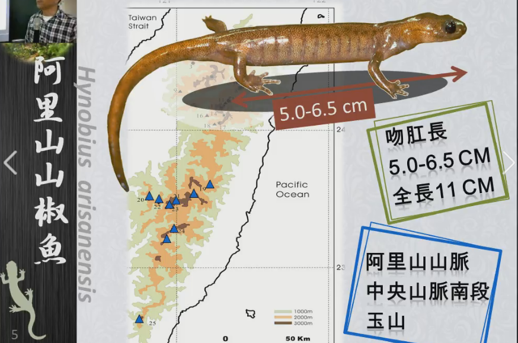
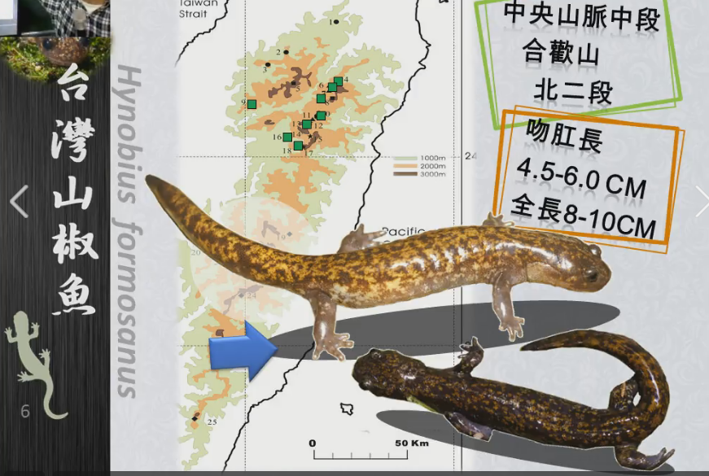
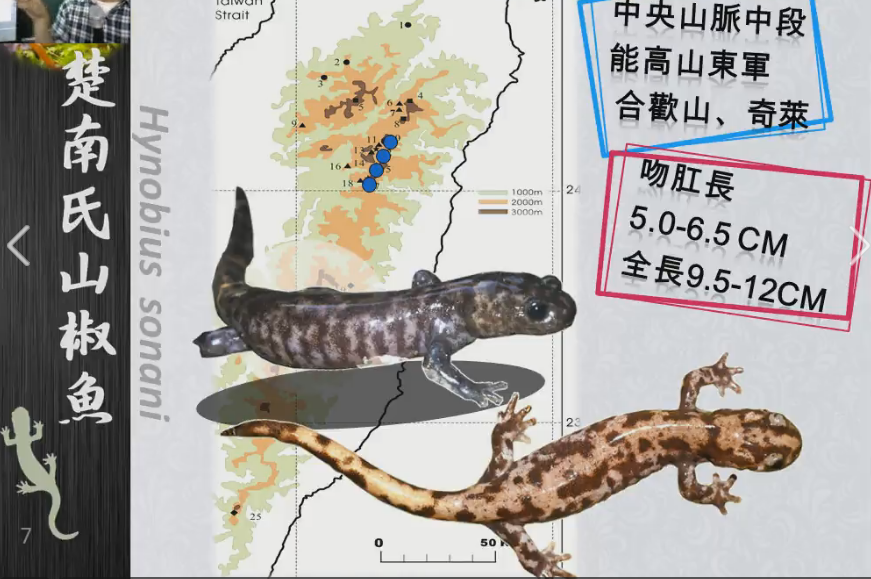
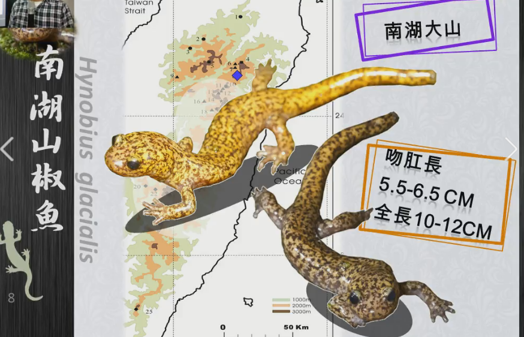
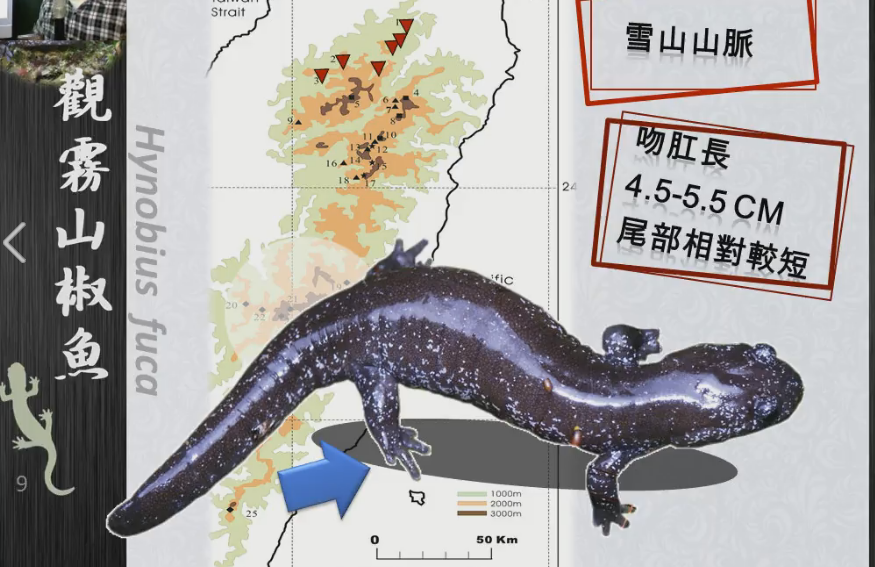

# Title: [2015兩棲志工-基礎班] 台灣的山椒魚 - 呂光洋老師

## 山椒魚的歷史

* 日本人楚南仁博首次發現 (1919年5月)
    * 追分 (翠峰) 1隻, 能高駐在所 1隻
* 安東伊次三郎 (1921年3月)
    * 阿里山
* 牧茂市郎 (1922)
    * 分3種: 楚南氏極北觬, 台灣山椒魚, 阿里山山椒魚
* Dunn (1923) 法國人
    * 共有特徵 (長鋤骨齒內枝), 連續變異: 合為一種: 楚南氏山椒魚
* 岡田彌一郎 (1935)
    * 2種: 楚南氏山椒魚, 台灣山椒魚 (阿里山山椒魚視為台灣山椒魚的同物異名)
* 佐藤歧雄 (1943)
    * 2種: 楚南氏山椒魚, 台灣山椒魚 (阿里山山椒魚視為台灣山椒魚的同物異名)
* 陳世煌 呂光洋 (1986)
    * 1種: 楚南氏山椒魚 (三種色型： 阿里山型, 能高形, 南湖型) + 觀霧型 (1993發現)
* 現在5種

## 種類

### 阿里山山椒魚

吻肛長: 5.0-6.5 cm, 全長: 11 cm

阿里山山脈, 中央山脈南段(北大武山), 玉山

### 台灣山椒魚

吻肛長: 4.5-6.0 cm, 全長: 8-10 cm

跟阿里山山椒魚一樣, 花紋比較細

中央山脈中段 (翠峰, 天池), 合歡山, 北二段

### 楚南氏山椒魚

吻肛長: 5.0-6.5 cm, 全長: 9.5-12 cm

花紋斑塊比較大

中央山脈中段, 能高安東軍, 合歡山, 奇萊

### 南湖山椒魚

吻肛長: 5.5-6.5 cm, 全長: 10-12 cm

南湖圈谷周圍有水的地方, 只有一點點, 翻石頭看看

### 觀霧山椒魚

吻肛長: 4.5-5.5 cm, 尾巴短, 看起來比較胖

顏色黑的, 白色斑點

雪山山脈北部

## 綜合

* 都在高山, 冰河時期流下來, 合歡山有2種重疊, 植物上也是物種的分界
* 都在西部溪流最源頭, 東部還沒發現

## 生態行爲

### 棲息地

分佈在高山上, 冰河退後, 留在高山上, 隔離作用, 隔離久的話就會 **生殖隔離**

目前東部沒發現, 大部分都在溪流最源頭, 接近棱線, 高山頂點

北部山椒魚在 1800m 左右 (北插天山)

世界上發現海拔最高的地方: 玉山圓峰營地 3850m 

微棲地偏好: 上面有苔蘚植物的石頭, 植物根系, 碎石, 腐植質多的不容易看到, 泥土多的比較容易找到

### 食物

土棲生物: 蚯蚓, 鼠婦...

### 天敵

帝稚, 菊池氏龜殼花, 高砂蛇, 標蛇, 斜鱗蛇

### 禦敵行爲

尾巴黏液有毒, 尾巴有些有傷痕

## 結論

* 台灣的山椒魚都是池塘型的, 不是溪流型的
* 台灣的山椒魚爲單系群
* 山脈成爲分歧主因

## 面臨困境

* 暖化影響
* 冬天(乾寄)繁殖 -> 冬天積雪, 融化就有水
* 台灣山椒魚成不連續性小族群分佈

## 補充

* [台灣山椒魚保育研究網](http://140.122.143.143/jslai/index.html)
* [尋找侏儸紀孑遺 觀霧山椒魚的故事](http://e-learning.froghome.org/mod/resource/view.php?inpopup=true&id=2334)
