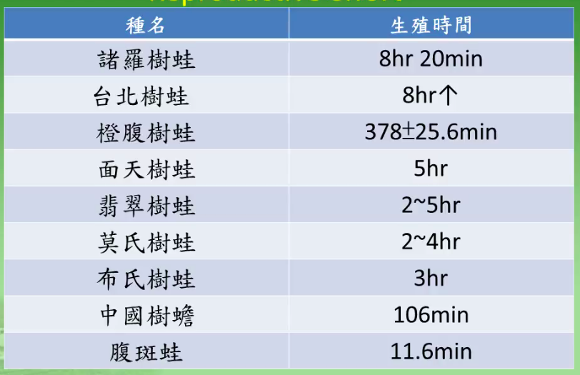

# Title: [兩棲課程] 生殖策略

## 生殖週期 / Reproductive Cycle

* 無足類: 2 年一次
* 有尾類: 2 年或 1 年一次
* 無尾類: 潮溼的熱帶地區顆連續繁殖, 1 年多次產卵; 季節性乾或冷的地區, 在繁殖季繁殖
* 1 年生殖 1-80,000 子代

### 影響生殖的因素

* 內分泌: 雄性激素 (雄), 雌性激素, 黃體素 (雌)...
* 外在因素:

    - 荷爾蒙變化收環境影響
    - 溫度影響配子
      - 亞熱帶及熱帶: 睾丸全年產生精子
      - 溫帶及高山: 低溫抑制精子產生
    - 繁殖季節收降雨影響
    - 營養狀態影響產卵數及卵的大小
    - 第二性徵隨季節變化

### 無尾目的生殖週期

- 熱帶及亞熱帶: 全年生殖, **降雨** 是刺激生殖的主要外在因子
- 溫帶: 主要受溫度及降雨影響, 呈現週期
- 繁殖開始的早晚受海拔高度影響
- 也可能受光或水中藻類味道影響
- 臺灣 15 種蛙類研究過

### 台灣蛙類繁殖季節

- 全年: 屏東的小雨蛙, 拉都, 斯文豪, 翡翠及中海拔的莫氏
- 春夏: 面天, 艾氏, 布氏, 中國樹蟾, 諸羅, 金線, 低海拔的莫氏, 腹斑, 橙腹, 褐樹蛙
- 秋冬春: 南部及東部的莫氏, 台北及梭德氏
- 同種蛙的繁殖也受海拔影響: 高海拔的莫氏在夏天繁殖, 低海拔在秋冬

#### 溫度和雨量的影響

- 同時受溫度和雨量影響: 台北, 面天, 翡翠, 低海拔的莫氏, 黑眶, 艾氏 => 溫暖潮溼的天氣活躍
- 溫度有關, 雨量無關: 在溪流的斯文豪, 褐樹蛙, 池塘的金線蛙 => 或許是水分來源穩定
- 雨量有關, 溫度無關: 拉都, 中國樹蟾, 橙腹, 小雨蛙 => 推測利用降雨積水繁殖

# 生殖模式 / Reproductive Mode

- 無足類: 體內受精, 75% 胎生, 卵生 (陸地產卵, 水棲幼體)
  
> 演化趨勢: 卵生 -> 直接發育 -> 胎生

- 有尾類: 體外受精-卵及幼體水棲, 體內受精: 90 %
- 無尾類: 體外受精, 體內受精
  - 29 種生殖模式: 3 大類
    1. 卵產於水域
    2. 卵產於陸域或樹上
    3. 卵留在母體輸卵管內

- 台灣有 33 種模式

資料來源: 楊姨懿如兩棲數位課程

### 無尾類的親方照顧

- 避免天敵或同類捕食: 玻璃蛙 (擬態)
- 移除死亡或受感染的卵
- 讓產於陸域的卵保持潮溼, ex: 染色箭毒蛙 雄蛙定期在卵上排尿
- 非洲牛蛙挖地道讓蝌蚪游到水邊
- 鏟鼻蛙產卵於地洞, 蝌蚪孵化後雌蛙挖地道通道水邊
- 攜帶卵及幼體: 負子蟾, 鏟足蟾
- 背部囊帶: 袋鼠蛙 (Marsupial frogs)
- 台灣艾氏樹蛙, 蝌蚪要雌蛙大腿外側, 雌蛙會生沒受精的卵給蝌蚪吃

  - 關永才教授研究:

    - 一直蝌蚪平均 56 天的生長期會吃 87 顆卵
    - 一個竹桶平均 25 隻蝌蚪
    - 平均吃掉 25x87 顆以上的卵
    - 雌蛙覓巢, 平均 8 天回來一次
      - 實驗:
        - 換蝌蚪 -> 找得到
        - 竹筒移動一公尺 -> 找得到
        - 改變高度 -> 死亡率上升
      - 覓巢靠的是視覺  
  
## 生殖行爲 / Reproductive Behavior

雄性好鬥, 交配行爲依賴雌性反應

### 交配地點

找到交配地點的方式:

- 聽覺: 50-70m
- 嗅覺: 藻類 (味道)
- 視覺: 天空 celestial cues (sun) 趨光性, 松果體 (pineal body) 爲光接受器
- 趨他性 Geotatic, 趨溼性 Hygrotatic response

### 第二性徵

終生或繁殖期出現

- 體型
- 腺體發育
- 皮膚質地 (雄蛙有鳴囊)
- 皮膚裝飾
- 鳴囊
- 顏色

#### 蠑螈

- 通常雌性比雄性大
- 雄性肛門膨大, 有肛門腺 (cloacal glands)

繁殖期的蠑螈外型:

- 皮膚光華
- 尾鰭及背鰭更發達, 顏色鮮明, ex:冠蠑螈
  作爲種間辨識, 提供視覺, 化學感覺及觸覺線索

#### 無尾類

- 體型 雌 > 雄
- 雄性較大
    1. 打架
    2. 齒突或刺 (福建大頭蛙, 下顎齒突)
- 繁殖贅生物 Nuptial Excrescences, 雄蛙表皮或真皮組織特化
  雄蛙婚墊, 蟾蜍的婚刺
- 雄蛙前臂比雌蛙發達 (拉都很明顯)
- 雄蛙腺體發達: 腹斑蛙的肩腺, 貢德臂腺 發達
- 雌蟾蜍背部顆粒比較粗糙 (其他種類不一定)
- 表皮特化: 非洲雄的毛蛙
- 肛門特化: 雄性尾蟾 (體內受精, 當作交配器), 負子蟾肛門特化
- 顏色
    - 雄性鳴囊色素沉澱
    - 蟾蜍雄性, 雌性顏色不同 (金蟾蜍)
    - 鳴叫時改變顏色: 日本樹蛙, 褐樹蛙 -> 公青蛙變金色  
- 鼓膜 (聽聲音, 也可以幫助聲音傳播, 像 speaker 一樣)
  - 赤蛙的雄蛙鼓膜比雌蛙大, 或一樣
  - 某些雄蛙耳柱骨突起
  
### 交配行爲 Courtship Behavior
  
- 無足類資料很少
- 有尾類:
    - 水中體外受精, 無交配: 小鯢科
    - 體內受精: 每一科都有獨特行爲
- 蠑螈科: 各種觸覺接觸，姿勢, 有的像跳舞一樣, 換位置
- 無尾科:
    - 確認對象
        - 雄蛙宣告叫聲 Advertisement calls
        - 嗅覺及視覺的展示不重要
        - 觸覺
    - 通常有雌性接近雄性
    - 交配前及交配後行爲
    - 蛙類抱接, 假交配 (台灣的都是腋下, 雄蛙的手在母蛙腋下)
    
### 受精及產卵 (Fertilization and Oviposition)

體外受精:

- 有尾類產卵於水中
- 無尾類產卵及受精由雌性及雄性同步完成

    卵是一顆一顆受精, 公的按一下母蛙, 母蛙把卵產在卵泡裡, 公的腳擡起來, 把精子撒在卵泡上, 母蛙用腳把卵體到泡沫裡

    - 泡沫卵塊
    
    ex: 翡翠樹蛙, 母蛙抱著公蛙走到其他現有卵泡那邊產在一起 (安全, 保留體力?), 水不夠的話, 母的背公的再跳入水中用肛門吸水, 在再回來繼續產

### 性擇

交配成功 Mating Success:

- 操作性比例偏雄性 (Operational sex radio) 時 [就是同一時間公的比較多], 雄性間變異大 [有的公的可以很多次, 有的沒機會]
- 猛爆性 (Explosive) 及短時間繁殖種類, ex: 史丹吉氏小雨蛙, 雄蛙間差異小
- 繁殖季長, 雄蛙有領域種類 (Male territoriality): 雄蛙重複交配次數高, ex: 台北樹蛙, 10-3月繁殖, 有的公蛙可以交配 6 次

性防禦 Sexual Defence:

- 雄性間競爭: 鳴叫, 咬追
- 干擾 (Interference) 及攔截 (Intercept)
- 長時間交配 (Prolonged amplexus): 12-125 days
- 在抵達繁殖地點前已經成對

性干擾 Sexual Interference:

別人的失敗就是我的成功

- 蠑螈
  - 偷雌性
  - 中斷對手釋出精莢
  - 蓋住對手的精莢
  - 欺騙對手排除無利可圖的精莢
  
- 無尾類
  - 衛星行爲 Satellite behavior, 或是性寄生 Sexual parasitism
  1. 衛星雄蛙等待鳴叫雄蛙交配後空下來的鳴叫位置或領域
  2. 衛星雄蛙攔截雌蛙
  3. 獲得 (一起) 交配機會, ex: 台北樹蛙一妻多夫, 產卵會呼朋引伴, 一起產
  

生殖干擾 Reproductive Interference:
  
- 干擾卵或幼體發育
- 同種食卵
- 可能出現於雄性或雌性

## 卵及蝌蚪的發育

### 台灣蛙類產卵頻度

資料來源: 楊姨懿如兩棲數位課程

### 台灣蛙類及蝌蚪發育期

卵期幾乎都是 2 星期內, 臺北樹蛙的蝌蚪期很久, 可以過冬

資料來源: 楊姨懿如兩棲數位課程

### 生殖努力 Reproductive effort

腹斑蛙很快 11.6 min, 打卵泡的很慢, 諸羅樹蛙要 8hr20min

資料來源: 楊姨懿如兩棲數位課程
