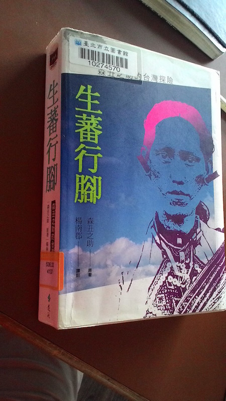

# [讀書] 任意節錄 森丑之助的「生蕃行腳」- 楊南郡譯註

2015.07.04 延平圖書館, 快速翻閱森丑之助的「生蕃行腳」。

## 以誠待人的唯一武器

各次旅行中，我從來不帶任何武器。帶武器去有什麼用呢? 帶武器到山地行動，好比是讓猴子扛這步槍和人類對抗一樣，一點用處也沒有！在山上行動我們體力遠不如蕃人，隨身攜帶的武器可能對突發的暴行有某種程度的防護作用，但絕不可能完全防衛自己。我所依靠的是對蕃人習慣信仰的尊重。

只有像我這樣的人，一生不顧正常的生活，只一昧追求人生志趣者，才敢單槍匹馬闖入危機四伏的蕃地，從容地進行探險旅行，所以蕃人絲毫不加害我這個對危險沒有戒心的旅行者。- p.593

## 輕裝踏查 - 阿爾卑斯式登山法 (Alpine Style)

爲了遂行探險的目的，做好萬全的準備以便一舉成功，是我們的期望。但是，準備之充足與否，可以說有一得一失，充足糧食與裝備需要僱用很多腳伕琲負，行程會變得緩慢，反而受到阻礙。我寧願採取非常的手段，組成一支小隊伍，用輕裝疾行的方式達成探險目的！ - p.331

## 地形調查

1908 年以前玉山東側的地形觀測與測量尚未展開，森丑之助和明志兩位，用徒步方式環繞玉山山脈一周，並從中央山脈大水窟及南二段南雙頭山一帶做詳細，才解明這個地理學上的謎題，實地踏查的過程是後學者最佳的典範。 - p.393

## 歸順, 和解

蕃語中，我們絕對找不到有「歸順」、 「順從」的意涵的語詞。在過去的年代清國政府經常討伐蕃人，每次打仗的時候，清軍遭受重大傷亡後才收拾殘局。通常清兵的傷亡比蕃人的傷亡大，可以說是每次都由清軍主動地要求和解。
和解都透過通曉蕃語的漢人通事居間處理。通事翻譯給清軍時，說「生蕃願意歸順」，但是翻譯給蕃人時候，因爲蕃語中沒有「歸順」的語詞，就用代表「和解」、「合約」的蕃語代替，北蕃語叫做 Sibarai、Sibirak，或 Mohetono。
