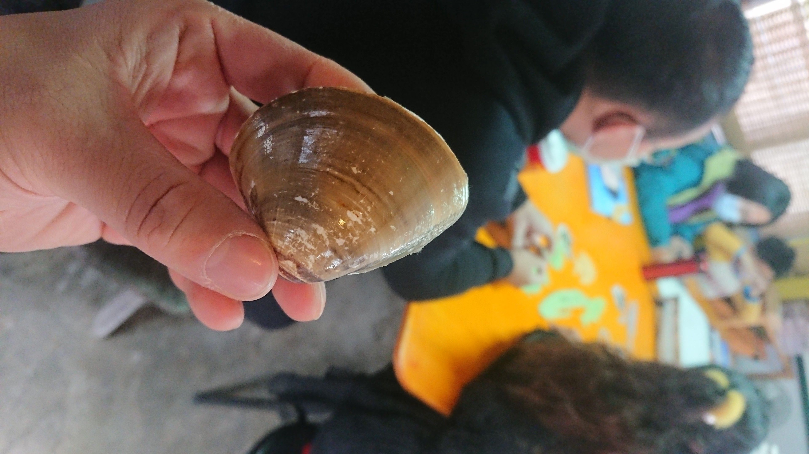

- 虱目魚跟蛤混養
- 十份
- 台灣島極西端
- 國聖燈塔、南灣碼頭
- 楊明忠藝術家 (奇美博物館…)
- 建功國小開始
- 2 本繪本

- 15/1000， 1度半 魚長最快
- 七股都是海水，土也是鹹的，不會抽地下水，但海水問題多，病菌多，只好降低養殖密度=> 魚開心
- 七股沒有工業區，比較沒有汙染的問題
- 曾文溪：青冥蛇 ，淹水泛濫後，改道， 300 年前是往將軍出海
- 感潮: 讓潮水自然進來
- 高雄，枋寮是用水管翻過河堤抽水 (地景不同)

- 比較尖的那端是吸吐水口，比較黑 (保護色) ，漁民開玩笑說曬黑
- 吐沙，給他原本生活的鹽分才會吐，3% ?
- 混養
- 虱目魚是工作魚，養來吃水裡的絲藻，還有白蝦可以吃魚吃剩的殘渣。
- 七股文蛤撈起來比較黑，後來才會變一般看到的顏色
- 全聯的文蛤是七股比較小
- 曬池的時候，水位比較低，黑皮會來
- 曬池：把土翻出來殺箘
- 光和箘 放了會變粉紅色 => 改善水質

## 相關鏈接

- [股份魚鄉 cofishland - 👏熱烈歡迎👏 聽說都是生物領域的專家呀😃 感謝做鳥類研究🐦的 Emi Paggy 揪團❤️，... | Facebook](https://www.facebook.com/coFishland/posts/pfbid0BqZ9Wi52QiyrArv1guEGiMsWmSQsBTeHPaWzNa7WH5dFQjmGKgibXHeuJBG4vDwjl)
- [【股份魚鄉】七股食魚教育&體驗遊程線上報名](http://cofishland.com.tw/onlineOrder/tour/)
- 行程: proton_drive://blog/股份漁鄉活動.pdf
