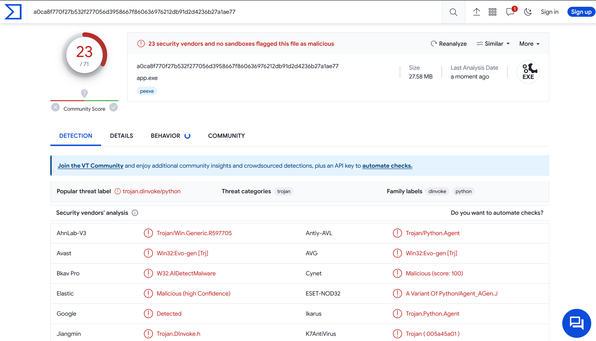
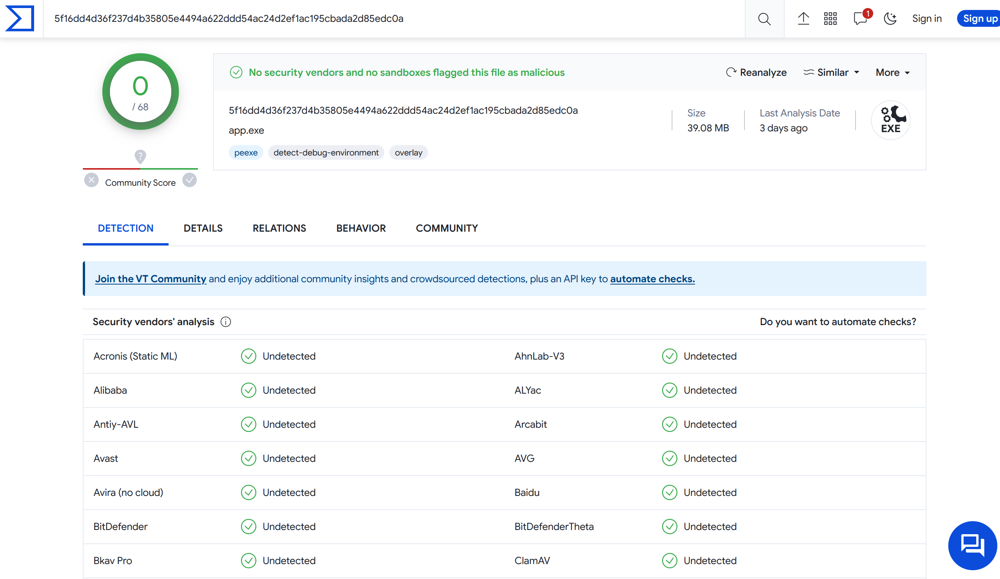

# Python 打包成Windows的exe檔遇到被當成病毒的問題

StackOverflow都是說自己build PyInstaller的bootloader可以解決，因此參考: [Building the Bootloader — PyInstaller 6.3.0 documentation](https://pyinstaller.org/en/stable/bootloader-building.html)


## Build PyInstaller bootloader

### 1. 準備build環境 (GCC...)


試了自己build MinGW，遇到zlib static找不到的問題。

發現這包([WinLibs - GCC+MinGW-w64 compiler for Windows](https://winlibs.com/))可以直接使用，方便很多。

(另外也許可以用[MSYS2](https://www.msys2.org/)，目前還沒試過)

### 2. Build from PyInstaller source code

```bash
git clone https://github.com/pyinstaller/pyinstaller
```

`cd pyinstaller\bootloader` 進入bootloader目錄

### 3. Start Build

```bash
python3 ./waf distclean all
```

### 4. Install

回到pyinstaller目錄，然後執行

```bash
python3 setup.py install
```

失敗的話換
```bash
pip install .
```

然後就可以執行pyinstaller指令了

## 測試結果

### VirusTotal

用[VirusTotal](https://www.virustotal.com/gui/home/upload)服務測試

原本預設(pip install)的Pyinstaller:




用另一套Nuitka (先轉成C++，功能強大)，但是也會被誤判。


Custom build PyInstaller的bootloader看起來就好很多了，實際上還需要更多驗證。



### 白名單處理

有人佛心整理了各家防毒軟體的誤判回報區

[hankhank10/false-positive-malware-reporting: Trying to release your software sucks, mostly because of antivirus false positives. I don't have an answer, but I do have a list of links to help get your code whitelisted.](https://github.com/hankhank10/false-positive-malware-reporting)

Blog說明
[How to stop your Python programs being seen as malware | by Mark Hank | Medium](https://medium.com/@markhank/how-to-stop-your-python-programs-being-seen-as-malware-bfd7eb407a7)
