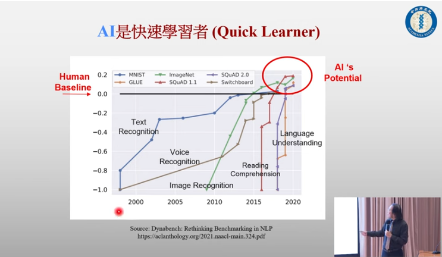
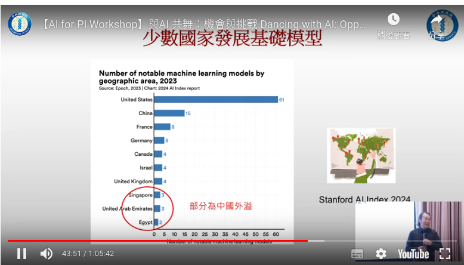

# Dancing with AI | 簡立峰老師於中央研究院的演說

[Dancing with AI | 簡立峰老師於中央研究院的演說 - Labs of Botsnova](https://labs.botsnova.com/2024/09/16/dancing-with-ai/)

- 訓練語料70%是英文
- AI很會寫程式，因為有open source
- 現在AI的神經元數量跟人類差不多，7000億個。
- Perfect Storm:
    - **A**I (Deep Learning Algorithms)
    - **B**ig Data (Internet Data)
    - **C**loud Computing
- GenAI/LLM非萬能
    - 不像傳統AI(google search)，弭平地方差異 (NTU在各個國家是不同意思)，LLM是一言堂。沒有時間感。
- 用AI最重要是generating ideas (就像聊天獲得靈感)

