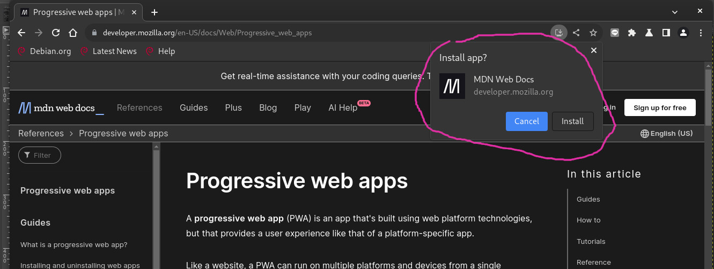
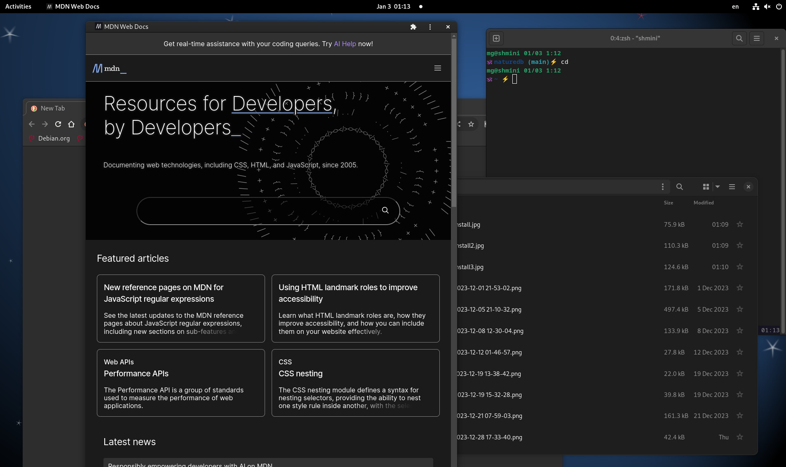

# PWA（Progress Web App）原來真的是App

目前使用的Floorp瀏覽器更新，提到[這次更新](https://blog.ablaze.one/3760/2023-12-23/)支援Windows的PWA（Progress Web App）跟SSB（Site-specific browser）。好奇去看了一下Floorp blog對PWA的介紹[Floorp のプログレッシブウェブアプリの機能と仕様 | ABlog](https://blog.ablaze.one/3711/2023-12-23/)，內文用[MDN](https://developer.mozilla.org/en-US/)這個開發網頁常需要查找資料的網站來當例子，原來PWA在瀏覽器上安裝後，在系統的應用程式圖示裡就真的會有一個新的Icon跑出來，執行的話就像是特別開一個網頁的應用程式。

引起我的興趣，我之前一直以為PWA跟RWD（Responsive Web Design）差不多，只是過幾年固定會出現的技術Buzz Word，原來他真的是接近原生App那樣的執行，操作界面在各種多到爆炸的前端工具/框架的網頁世界裡，開發起來真的是方便很多，還有service workers可以支援離線，雖然我覺得比起Native App還有很多先天無法克服的，但是已經是從網頁、網頁的擴充功能（extension）那邊跨出很大的一步了，想到一些之前開發桌機App考慮用到類似[Electron](https://www.electronjs.org/)的工具，現在知道了PWA，還有另一種不同的選擇了。

## 在Linux用Chromium安裝PWA

目前Floorp只支援Windows，試試看Linux(Debian 12 Bookworm)的Chromium，也是可以安裝。

應用程式區有Icon了

執行起來長這樣

可以uninstall

## PWA的真實案例

除了上面提到的MDN，還有Spotify, Uber, Pinterest... 也都有做PWA。

