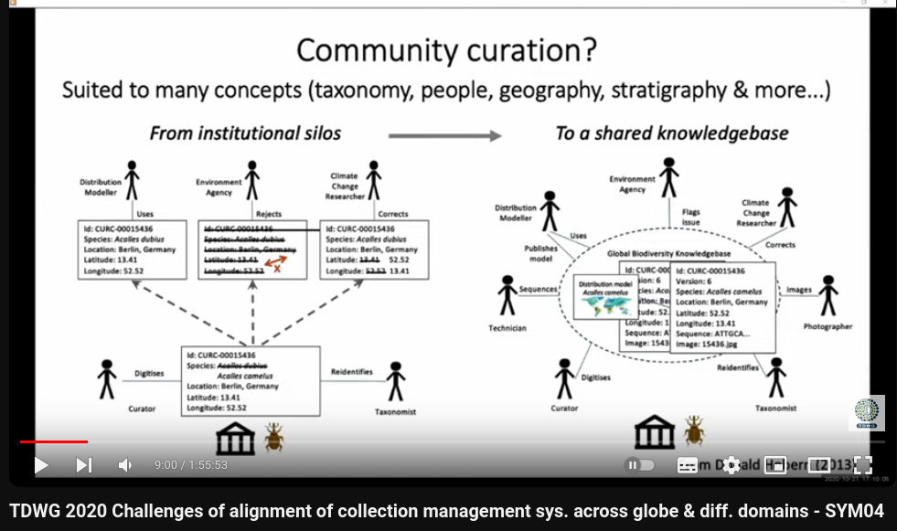
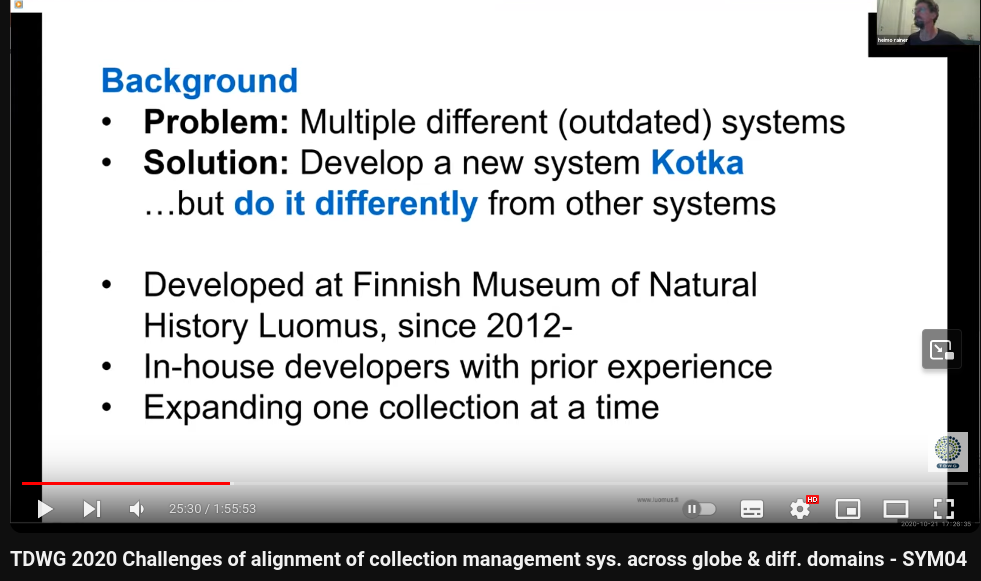

# Collection Management Systems (TDWG 2020 Symposium)

<iframe width="560" height="315" src="https://www.youtube.com/embed/vLXcJej9Vbw?si=UxZ-u9TKr29yjXp6" title="YouTube video player" frameborder="0" allow="accelerometer; autoplay; clipboard-write; encrypted-media; gyroscope; picture-in-picture; web-share" referrerpolicy="strict-origin-when-cross-origin" allowfullscreen></iframe>

[TDWG 2020 Challenges of alignment of collection management sys. across globe & diff. domains - SYM04 - YouTube](https://www.youtube.com/watch?v=vLXcJej9Vbw)

隨筆紀錄一下TDWG 2020關於自然史典藏系統的討論(線上)，已經是4年前的討論了，有的似乎也沒有在維護了，仍有參考價值。

## RECODE

Vince Smith

英國自然史提出的解決方案，完整的data model，滿強調Linked Data，很有啟發性。

- [RECODE: Towards a next-gen collections management system as part of the institutional and community data ecosystem](https://biss.pensoft.net/article/90886/)
- [OSF | RECODE community workshop slides 2020-12-08.pptx](https://osf.io/uwabk)
- [VPS_91297_Collier.pdf - Google 雲端硬碟](https://drive.google.com/file/d/1ISkRF-Ngoi3s70deAi1cB6J08su0Ebag/view) poster

多人協作?

NHM data workflow

NHM與世界的連結

RECODE Data Model的關鍵: CollectionObject

## Kotka

芬蘭的自然史典藏系統，強調Simple and Flexible，不用關聯式資料庫，很像新創邊移動邊開槍的模式。

Mikko Heikkinen

[Collection Management System | Suomen Lajitietokeskus](https://laji.fi/about/796)

- focus on 80/20-rule, flexibility and simplicity
- not focus on comprehensive data model (denormalized data)

沒有好用的系統、又有開發的人，所以就可以自幹

跨組織要使用，要讓系統簡單而保持彈性。因為非技術的問題就夠麻煩的了。

## Symbiota

去中心化系統很厲害，但感覺要花很多精力處理系統之間的同步，不知道是不是美國這種人多地大物博的才運作的起來?

Edward Gilbert

- decentralized data network (isolated decentralized network of mini-aggregators)
- live-managed Vs. snapshot

## Specify

新版(Specify 7)轉移到網頁，很大的破壞式更新。

- Community-Driven decision making

## DINA

不知道是不是沒繼續了，感覺沒有很活躍?

**DI**gital Information system for **NA**tural history data)

[DINA: Open Source and Open Services - A Modern Approach for Sustainable Natural History Collection Management Systems](https://biss.pensoft.net/article/20216/)

- web-based modules, throuth API, components can be modified or replaced by other components

## Meeting In-Between: Moving beyond the buzz, bottlenecks, and bubble to collaboratively develop digitization tooling

很讚的總結，但我暫時無法吸收了。

Matt Yoder

- Digital Specimens in TaxonWorks
