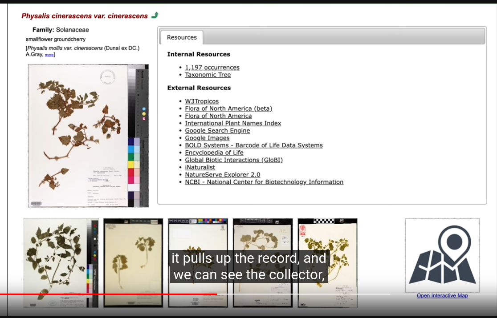
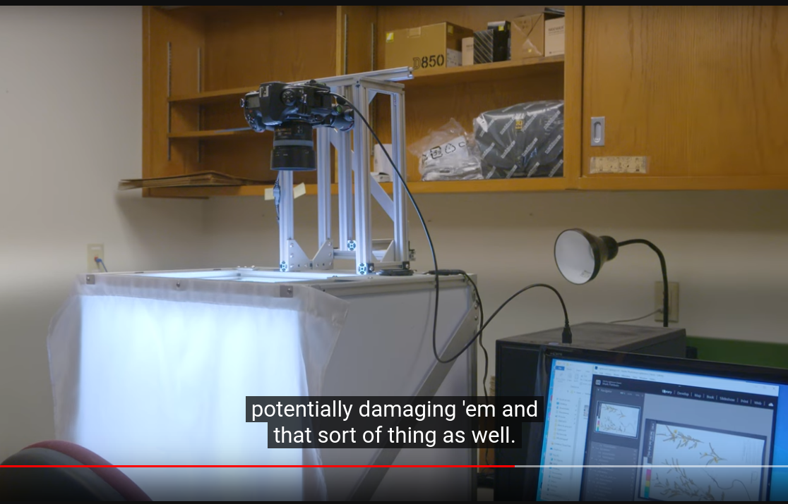

# Research of Digitizing Herbarium

## Case1: Oklahoma State Universaty Herbarium

- [Herbarium | Oklahoma State University](https://cas.okstate.edu/plant_biology/about_us/herbarium.html)
- [Herbarium Details | Oklahoma State University](https://sweetgum.nybg.org/science/ih/herbarium-details/?irn=125598) Index Herbarium
- [TORCH – The Texas Oklahoma Regional Consortium of Herbaria](https://www.torcherbaria.org/)

### Search portal (Symbiota)

Select dataset:

Filter by taxon:

Other Filters:

Filter results:

Species page:

Specimen page:

### Digitizing Process

Imaging:

Transcription from label and image information by volunteering and student worker

upload images to [Notes from Nature — Zooniverse](https://www.zooniverse.org/organizations/md68135/notes-from-nature) for volunteers to help transcribe.

ref: [Digitizing Herbariums for Future Historians - YouTube](https://www.youtube.com/watch?v=Exxrj1OfSjc)

## Case2: University of Alaska Herbarium (ALA)

- [University of Alaska Herbarium (ALA): Documenting Alaska's flora at the crossroads of Beringia - YouTube](https://www.youtube.com/watch?v=1zMgQYwWArI)

## ArctosDB

