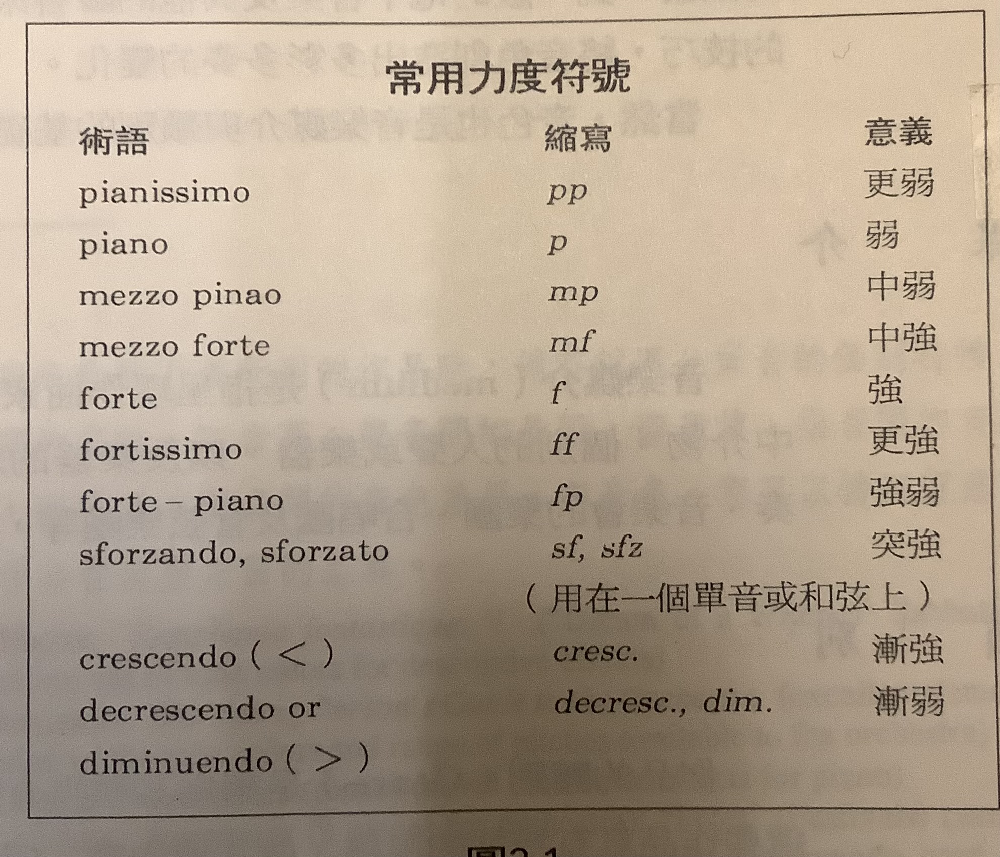
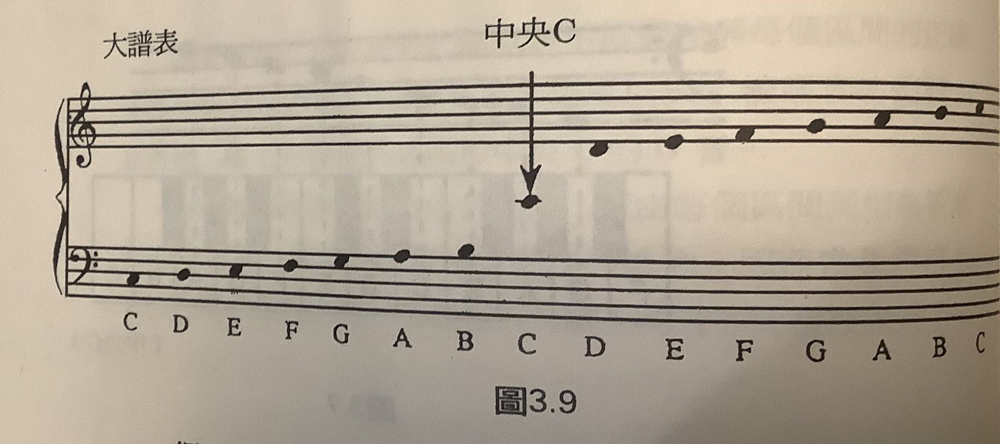
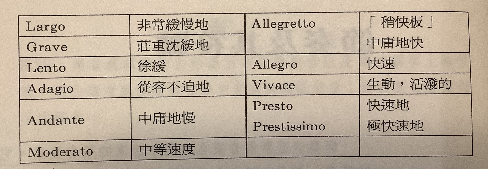
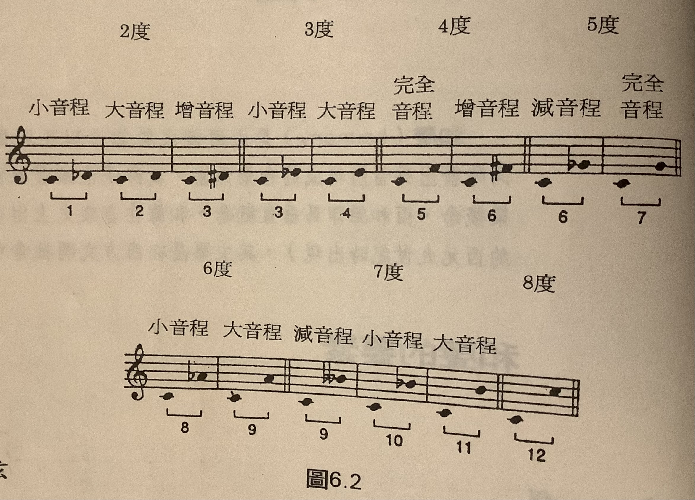

# About Music

- 《Introduction to Music》Hugh M. Miller, Paul Taylor, Edgar Williams

## 西方藝術音樂基礎原理

### 音樂欣賞

(p.4-5)

4種音樂欣賞者類型:

- 被動型
    - 音樂作為背景
    - 餐廳, 電影, 運動場
- 感官型
    - 享受聽覺樂趣
    - 欣賞入門
- 情感型
    - 因音樂帶動感情及情緒
- 理解型
    - 專注音樂本身
    - 明白所聽的音樂之特性及內容
    - 養成對音樂藝術感受的主觀認知

(me: 佛教的色受想行識)

### 聲音

4種特性:

- 音高 Pitch
    - 人耳可感測到的音高範圍: 20-20kHz (一般音樂: 30-4200Hz)
- 音值 Duration
- 強度 Intensity
    - 漸強: crescendo
    - 漸弱: diminuendo
- 音色 Timbre (音質)

### 記譜法

### 節奏及其符號

節奏的要素:

- 拍子 Beat
- 速度 Tempo
- 節拍 Meter

<figure markdown="span">
  
  <figcaption>常見的速度</figcaption>
</figure>

#### 節奏記譜法

略

### 旋律

旋律的結構:

- 旋律通常可分爲較小的單位，稱為樂句（phrases）
    - 如同語言中的停頓點或者詩篇中的一行詩
    - 在一般音樂形式中，樂句至少包含一個完整的理念，並且往往由其他樂句以某些停頓形式加以襯托出來
    - 這種停頓或多或少顯示了不同程度的終止感（有點像是文章中的逗號、頓號或冒號）；或顯示一種明確的結束（如同文章中的整句）
    - 音樂中稱這個樂句句尾停頓的片語爲**終止式（cadence）**

旋律的構成組型:

**動機 Motive**

- 音樂中最小的結構單位是動機
    - 動機是一個短短的旋律、節奏或者兼具旋律與節奏的數音
    - 通常由六至八個音符組成
    - 形成了音樂作品發展的結構
    - 猶如語言中的前置句或其他的語意單位
    - 動機是片斷的概念，不可能單獨存在；而是扮演作品中「細胞」的角色。
- 動機可運用在建築某段樂句、曲調、主題或較長的樂節上。
- 作曲家主要以下面幾種方式建立其主動的動機：
    - （1）逐音地再述
    - （2）以較高或較低的音程來再現〔例如，模進反復（sequential repetition）〕或者簡單的續奏（sequence），
    - （3）利用其節奏特色與旋律特徵來轉化
    - （4）結合其他的動機
    - （5）以其他的聲音、樂器或技巧來加以模仿。
    這些動機的循環，建構了一首完整的作品。

**曲調 Tune**

旋律最基本的形式。易於唱歌與記憶的簡要旋律。如：民謠、舞曲、流行音樂、一些交響曲的旋律片段。

**主題 Theme**

一首大型的音樂作品，譬如交響樂的樂章，通常會包含數個旋律以及旋律片段；在這之中，有些作品會被賦予一個中心的目的。我們稱包含作品中心思想的旋律——即作曲家創作的概念一爲主題（theme）。如同小說中主題作為故事發展與場景轉換的軸心一樣，音樂的主題也引領整首曲子的進展。就一般的概念來說，一首廣泛的作品表現出對於其主題生命性的探索—包含起源、互動、成長、蛻變，以及終極的命運。在作品的進行中，主題常會穿插在不同的片段中，成為作曲家表達其個性差異的探索工具。

音樂主題或許短得如同單一樂句，或許長得如整首曲調。

它主要是受到形式的導引（見第8章所探討的形式），或者它可採用較鬆散自在的動機旋律。它的特色主要隨著作品形式中所呈現出的角色變化而定。爲了保有主要的音樂概念，主題通常以一種易辨認的旋律、和聲、節奏，或者其他的特質再現於整首作品中。

### 和聲與調性

#### 和聲(Harmony)的要素

**音程**

Quality of Interval:

- perfect
- major
- minor

**和弦**

<figure markdown="span">
  
  <figcaption>三和弦與其他和弦</figcaption>
</figure>

**調性 Tonality**

(略)

## 西方藝術音樂概論

(> p.107)

TODO
