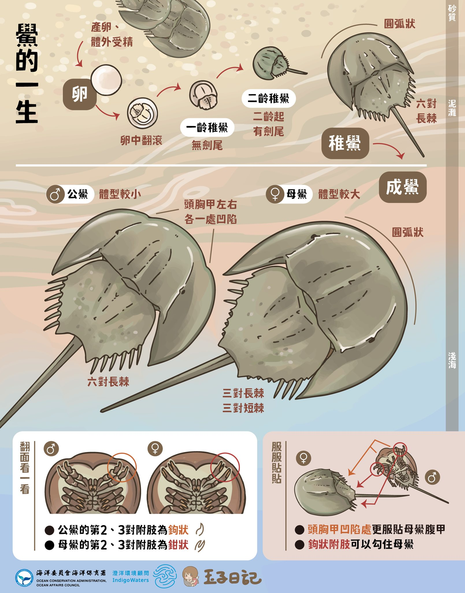

# 物種描述

## 爬蟲

### 蛇

#### 蛻皮

- 蛇會蟄伏變瘦一點再蛻完皮大吃一餐 [^1]
- 由於蛻皮時會伸縮身體將皮延展，所以退下來的皮通常都比原本個體來的大一點 [^1]

## 節肢動物

#### 蠅虎
台灣有41種。

- [模仿螞蟻的蜘蛛 | 演化之聲 The Sound of Evolution的沙龍](https://vocus.cc/article/665881fafd897800012239ed) 科氏翠蛛

[^1]: 淳凱, line

## 海洋

來源: [海洋委員會海洋保育署 - 【 濃情相扣的盔甲鴛鴦 三棘鱟 】... | Facebook](https://www.facebook.com/ocaoactaiwan/posts/pfbid02jhTgCTcEEofe8zV6pARNV6iMiPbJVwTFk9ModSnDZ3xJ77kJniZmRTBdcEk2K5BFl)

[海洋委員會海洋保育署 - 【🌱海面下的綠草如茵——海草床🌱】... | Facebook](https://www.facebook.com/ocaoactaiwan/posts/pfbid0DNtQusk2fCh71hk2Xcg6UNfhcVLRL23qYjnv3tQEdW4MThfpU6pgG5sX6aqfkJqTl)
