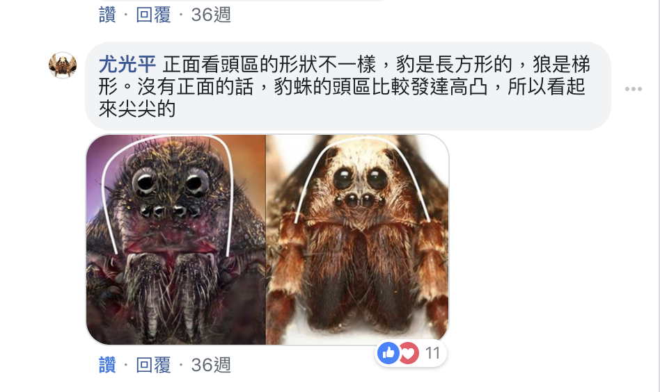

# 動物檢索/圖鑑/辨識

## 鳥類

鶺鴒

## 哺乳動物

### 白鼻心、鼬獾、食蟹獴

|        | 尾巴         |      臉紋            |   耳朵     |  專長 | 日夜 | 體長(cm) |  其他      |
| ------ | -------------| -------------------- | ---------- | ----- | ---- | ----- |---------- |
| 白鼻心 | 細長、末端黑 | 白斑從鼻端到頭頂     | 像貓       | 爬樹  | 夜行 | 75-81 |            |
| 鼬獾   | 短、毛蓬鬆   | 花臉白斑(不連續條紋) | 大、有白毛 | 挖土  | 夜行 | 40-60 | 鼻子尖     |
| 食蟹獴 | 蓬鬆         | 兩鬢有白斑           | 小圓       |       |      | 55-75 | 全身毛蓬鬆 |

圖片與資料來源: [【我才跟牠不一樣！】鼬獾、白鼻心、食蟹獴？ - 窩窩｜專注為動物發聲的獨立媒體](https://wuo-wuo.com/topics/widlife/64-comparison-and-similar-animals/1630-i-was-with-him-is-not-the-same-formosan)

### 排遺

## 蟲蟲

### 蜘蛛

豹蛛(Pardosa)跟狼蛛(Lycosa)比較。 `都是狼蛛科`

忘記是那裡截圖的

## 海洋

來源: [邱郁文 - <練習題: 用一張影像 給AI 題目撰寫招生和徵人的文案>... | Facebook](https://www.facebook.com/permalink.php?story_fbid=pfbid02sJbvrYx1tBkKP4gXCGCuQ7YJYT65r2F48CFpM2QtkWjLPBsXNt8nQTYPuo198uSXl&id=619543911)
