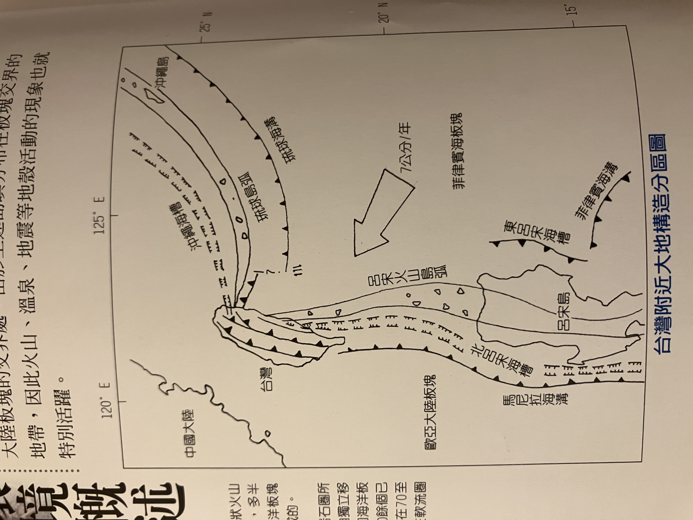

# 台灣

- 花采列島中段
- 花采列島中算火山活動少、無活動火山
    - 因為: 弧狀凸向大陸而非太平洋，與其他島弧相反

## 海岸

- 台灣本島海岸線總長1250km
- 台灣海峽海底平緩，深度在200m內，最淺不到100m
- 分佈:
    - 北部: 沈降海岸
    - 東部: 斷層海岸
    - 南部: 珊瑚礁海岸
    - 西部: 隆起海岸

## 島嶼

- 68個大小島嶼
- 澎湖群島: 64個

## 海流

- 中國沿岸冷流: 由黃河北部，沿著中國東海岸南下，冬季受東北季風影響而增強(水溫遠低於黑潮)。夏季因西南氣流影響而減弱(水溫與黑潮相近)，影響澎湖以西，對本島影響不大。
- 南中國海季風流: 夏季從台灣海峽流向東北。冬季對西部海岸影響很小，冬季由南往北的黑潮跟北往南的中國沿岸冷流在澎湖附近海域形成逆時針方向流動。
- 黑潮支流: 黑潮主流延台灣東岸往北。冬季受東北季風影響，支流大部分經過巴士海峽後折向流入南中國海。夏季西南季風使黑潮強度增加，支流沿台灣北上，經過澎湖海域，再北上和黑潮主流會合。

